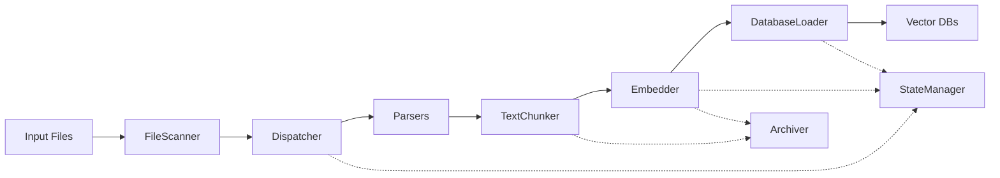

# ELESS Developer Guide

Complete guide for developers working on or extending the ELESS system.

## Table of Contents

- [Development Setup](#development-setup)
- [Architecture Overview](#architecture-overview)
- [Code Structure](#code-structure)
- [Development Workflow](#development-workflow)
- [Testing](#testing)
- [Adding New Features](#adding-new-features)
- [Performance Optimization](#performance-optimization)
- [Debugging](#debugging)
- [Contributing](#contributing)

---

## Development Setup

### Prerequisites

- Python 3.8+
- pip or poetry
- Git
- Virtual environment tool (venv, virtualenv, or conda)

### Initial Setup

```bash
# Clone the repository
git clone https://github.com/Bandalaro/eless.git
cd eless

# Create virtual environment
python3 -m venv venv
source venv/bin/activate  # On Windows: venv\Scripts\activate

# Install development dependencies
pip install -e ".[dev,full]"

# Install pre-commit hooks
pre-commit install
```

### Development Dependencies

The `dev` extras include:
- `pytest` - Testing framework
- `black` - Code formatter
- `flake8` - Linter
- `mypy` - Type checker
- `pre-commit` - Git hooks

### IDE Setup

#### VSCode

Create `.vscode/settings.json`:

```json
{
  "python.linting.enabled": true,
  "python.linting.flake8Enabled": true,
  "python.formatting.provider": "black",
  "python.testing.pytestEnabled": true,
  "python.testing.pytestArgs": ["tests"],
  "editor.formatOnSave": true
}
```

#### PyCharm

1. Mark `src/` as Sources Root
2. Mark `tests/` as Test Sources Root
3. Enable pytest as test runner
4. Configure Black as external tool

---

## Architecture Overview

### System Layers

```
┌─────────────────────────────────────────┐
│         CLI Interface (Click)           │
├─────────────────────────────────────────┤
│      ElessPipeline (Orchestrator)       │
├──────────┬──────────┬───────────────────┤
│ Scanner  │Dispatcher│  State Manager    │
├──────────┼──────────┼───────────────────┤
│ Parsers  │ Chunker  │  Archiver         │
├──────────┴──────────┼───────────────────┤
│      Embedder       │  Resource Monitor │
├─────────────────────┼───────────────────┤
│  Database Loader    │  Logging System   │
└─────────────────────┴───────────────────┘
```

### Data Flow



### Core Design Principles

1. **Resumability**: Every stage can be resumed from cache
2. **Graceful Degradation**: Missing dependencies don't crash the system
3. **Memory Efficiency**: Streaming processing for large files
4. **Observability**: Comprehensive logging at all levels
5. **Extensibility**: Plugin architecture for parsers and databases

---

## Code Structure

### Directory Layout

```
eless/
├── src/                        # Source code
│   ├── cli.py                  # CLI entry point
│   ├── eless_pipeline.py       # Main orchestrator
│   ├── core/                   # Core utilities
│   │   ├── config_loader.py    # Configuration management
│   │   ├── state_manager.py    # State tracking
│   │   ├── archiver.py         # Cache management
│   │   ├── logging_config.py   # Logging setup
│   │   └── resource_monitor.py # Resource monitoring
│   ├── processing/             # File processing
│   │   ├── file_scanner.py     # File discovery
│   │   ├── dispatcher.py       # Parser routing
│   │   ├── streaming_processor.py  # Streaming handler
│   │   └── parsers/            # File type parsers
│   │       ├── text_chunker.py
│   │       ├── pdf_parser.py
│   │       ├── docx_parser.py
│   │       └── html_parser.py
│   ├── embedding/              # Embedding generation
│   │   ├── embedder.py         # Embedding orchestrator
│   │   └── model_loader.py     # Model management
│   └── database/               # Database integrations
│       ├── db_loader.py        # Database orchestrator
│       ├── db_connector_base.py # Base connector class
│       ├── chroma_connector.py
│       ├── qdrant_connector.py
│       ├── faiss_connector.py
│       ├── postgres_connector.py
│       └── cassandra_connector.py
├── tests/                      # Test suite
│   ├── fixtures/               # Test data
│   ├── test_cli.py
│   ├── test_config_validation.py
│   ├── test_end_to_end.py
│   ├── test_error_handling.py
│   ├── test_package.py
│   ├── test_parallel.py
│   └── test_pipeline_integration.py
├── config/                     # Configuration files
│   └── default_config.yaml
├── docs/                       # Documentation
│   ├── API_REFERENCE.md
│   └── DEVELOPER_GUIDE.md
├── scripts/                    # Utility scripts
├── pyproject.toml              # Package configuration
├── setup.py                    # Setup script
└── README.md                   # User documentation
```

### Module Responsibilities

#### `src/cli.py`
- Command-line interface definition
- Argument parsing and validation
- Configuration override handling
- Entry point for all commands

#### `src/eless_pipeline.py`
- Main orchestration logic
- Component initialization
- Pipeline execution
- Cleanup and error handling

#### `src/core/`
- **config_loader.py**: Hierarchical config loading, merging, validation
- **state_manager.py**: File status tracking, manifest management
- **archiver.py**: Chunk and vector caching to disk
- **logging_config.py**: Centralized logging setup, performance decorators
- **resource_monitor.py**: CPU/memory monitoring, adaptive throttling

#### `src/processing/`
- **file_scanner.py**: Recursive directory scanning, hash generation
- **dispatcher.py**: Parser selection, chunking coordination
- **streaming_processor.py**: Memory-efficient large file handling
- **parsers/**: Format-specific text extraction

#### `src/embedding/`
- **embedder.py**: Embedding workflow, caching, batch processing
- **model_loader.py**: Model loading, inference, device management

#### `src/database/`
- **db_loader.py**: Multi-database coordination, batch uploading
- **db_connector_base.py**: Abstract interface for connectors
- **[db]_connector.py**: Database-specific implementations

---

## Development Workflow

### 1. Create a Feature Branch

```bash
git checkout -b feature/my-new-feature
```

### 2. Make Changes

Follow these guidelines:
- Write docstrings for all public functions/classes
- Add type hints
- Keep functions small and focused
- Use descriptive variable names

### 3. Run Tests

```bash
# Run all tests
pytest tests/

# Run specific test file
pytest tests/test_pipeline_integration.py

# Run with coverage
pytest tests/ --cov=src --cov-report=html
```

### 4. Format and Lint

```bash
# Format code
black src/ tests/

# Check linting
flake8 src/ tests/

# Type checking
mypy src/
```

### 5. Commit Changes

```bash
git add .
git commit -m "feat: add support for new parser"
```

Commit message format:
- `feat:` - New feature
- `fix:` - Bug fix
- `docs:` - Documentation changes
- `test:` - Test additions/changes
- `refactor:` - Code refactoring
- `perf:` - Performance improvements

### 6. Push and Create PR

```bash
git push origin feature/my-new-feature
```

---

## Testing

### Test Organization

Tests are organized by functionality:
- `test_cli.py` - CLI interface tests
- `test_config_validation.py` - Configuration validation
- `test_end_to_end.py` - Full pipeline integration tests
- `test_error_handling.py` - Error recovery scenarios
- `test_parallel.py` - Parallel processing tests
- `test_pipeline_integration.py` - Component integration tests

### Running Tests

```bash
# All tests
pytest tests/

# Specific test file
pytest tests/test_cli.py

# Specific test class
pytest tests/test_cli.py::TestCLI

# Specific test method
pytest tests/test_cli.py::TestCLI::test_cli_process

# With verbose output
pytest tests/ -v

# With detailed output
pytest tests/ -vv

# Stop on first failure
pytest tests/ -x

# Run only failed tests from last run
pytest tests/ --lf

# Run in parallel
pytest tests/ -n auto
```

### Writing Tests

#### Unit Test Example

```python
import unittest
from src.core.state_manager import StateManager, FileStatus

class TestStateManager(unittest.TestCase):
    def setUp(self):
        """Set up test fixtures."""
        self.config = {
            "cache": {
                "directory": "/tmp/test_cache",
                "manifest_file": "test_manifest.json"
            }
        }
        self.state_manager = StateManager(self.config)
    
    def test_add_file(self):
        """Test adding a new file."""
        self.state_manager.add_or_update_file(
            "abc123",
            "/path/to/file.txt",
            FileStatus.PENDING
        )
        
        status = self.state_manager.get_status("abc123")
        self.assertEqual(status, FileStatus.PENDING)
    
    def tearDown(self):
        """Clean up test fixtures."""
        # Clean up test files
        pass
```

#### Integration Test Example

```python
def test_full_pipeline(self):
    """Test complete pipeline execution."""
    # Setup
    pipeline = ElessPipeline(self.config)
    test_file = self.create_test_file()
    
    # Execute
    pipeline.run_process(test_file)
    
    # Verify
    files = pipeline.state_manager.get_all_files()
    self.assertEqual(len(files), 1)
    self.assertEqual(files[0]["status"], FileStatus.LOADED)
```

### Test Coverage

Maintain >80% code coverage:

```bash
pytest tests/ --cov=src --cov-report=term-missing
```

---

## Adding New Features

### Adding a New Parser

1. **Create Parser Class**

Create `src/processing/parsers/my_parser.py`:

```python
import logging

logger = logging.getLogger("ELESS.MyParser")

def parse_my_format(file_path: str) -> str:
    """
    Parse my custom format and extract text.
    
    Args:
        file_path: Path to the file
        
    Returns:
        Extracted text content
        
    Raises:
        ValueError: If file format is invalid
    """
    try:
        with open(file_path, 'r') as f:
            # Your parsing logic here
            text = f.read()
        
        logger.info(f"Parsed {file_path}")
        return text
        
    except Exception as e:
        logger.error(f"Failed to parse {file_path}: {e}")
        raise
```

2. **Register Parser in Dispatcher**

Edit `src/processing/dispatcher.py`:

```python
from .parsers.my_parser import parse_my_format

class Dispatcher:
    def __init__(self, config, state_manager, archiver):
        # ... existing code ...
        
        # Register parser
        self.parsers = {
            ".txt": self._handle_text_file,
            ".myformat": parse_my_format,  # Add this
            # ... other parsers ...
        }
```

3. **Add Tests**

Create `tests/test_my_parser.py`:

```python
import unittest
from src.processing.parsers.my_parser import parse_my_format

class TestMyParser(unittest.TestCase):
    def test_parse_valid_file(self):
        """Test parsing valid file."""
        text = parse_my_format("tests/fixtures/sample.myformat")
        self.assertIsNotNone(text)
        self.assertGreater(len(text), 0)
    
    def test_parse_invalid_file(self):
        """Test parsing invalid file."""
        with self.assertRaises(ValueError):
            parse_my_format("tests/fixtures/invalid.myformat")
```

### Adding a New Database Connector

1. **Create Connector Class**

Create `src/database/my_db_connector.py`:

```python
from .db_connector_base import DBConnectorBase
import logging

logger = logging.getLogger("ELESS.MyDBConnector")

class MyDBConnector(DBConnectorBase):
    """Connector for MyDB vector database."""
    
    def __init__(self, config, db_config, vector_dim):
        super().__init__("mydb", vector_dim)
        self.config = config
        self.db_config = db_config
        self.client = None
    
    def connect(self) -> bool:
        """Establish connection to MyDB."""
        try:
            # Your connection logic
            logger.info("Connected to MyDB")
            return True
        except Exception as e:
            logger.error(f"Failed to connect: {e}")
            return False
    
    def upsert_vectors(self, data):
        """Insert or update vectors."""
        try:
            # Your upsert logic
            logger.info(f"Upserted {len(data)} vectors")
            return True
        except Exception as e:
            logger.error(f"Failed to upsert: {e}")
            return False
    
    def disconnect(self):
        """Close connection."""
        if self.client:
            self.client.close()
            logger.info("Disconnected from MyDB")
```

2. **Register in DatabaseLoader**

Edit `src/database/db_loader.py`:

```python
from .my_db_connector import MyDBConnector

class DatabaseLoader:
    def _create_connector(self, db_name, db_config):
        db_type = db_config.get("type", "").lower()
        
        if db_type == "mydb":
            return MyDBConnector(self.config, db_config, self.vector_dim)
        # ... existing connectors ...
```

3. **Add Configuration**

In `config/default_config.yaml`:

```yaml
databases:
  targets:
    - mydb
  connections:
    mydb:
      type: mydb
      host: localhost
      port: 9999
      collection_name: eless_vectors
```

4. **Add Tests**

```python
def test_mydb_connector(self):
    """Test MyDB connector."""
    connector = MyDBConnector(config, db_config, 384)
    self.assertTrue(connector.connect())
    
    data = [{"id": "1", "vector": [0.1] * 384}]
    self.assertTrue(connector.upsert_vectors(data))
    
    connector.disconnect()
```

### Adding CLI Commands

Edit `src/cli.py`:

```python
@cli.command()
@click.argument('input_path')
@click.option('--format', default='json', help='Output format')
def export(input_path, format):
    """Export processed data to a file."""
    click.echo(f"Exporting {input_path} as {format}...")
    
    # Your export logic
    
    click.echo("Export complete!")
```

---

## Performance Optimization

### Profiling

#### CPU Profiling

```python
import cProfile
import pstats

profiler = cProfile.Profile()
profiler.enable()

# Your code here
pipeline.run_process(source_path)

profiler.disable()
stats = pstats.Stats(profiler)
stats.sort_stats('cumulative')
stats.print_stats(20)
```

#### Memory Profiling

```python
from memory_profiler import profile

@profile
def process_large_file(file_path):
    # Your code here
    pass
```

### Optimization Strategies

#### 1. Batch Processing

```python
# Bad: Process one at a time
for chunk in chunks:
    vector = model.encode([chunk])
    
# Good: Process in batches
batch_size = 32
for i in range(0, len(chunks), batch_size):
    batch = chunks[i:i + batch_size]
    vectors = model.encode(batch)
```

#### 2. Streaming

```python
# Bad: Load entire file
with open(file_path) as f:
    text = f.read()
    
# Good: Stream file
def read_in_chunks(file_path, chunk_size=8192):
    with open(file_path, 'r') as f:
        while True:
            chunk = f.read(chunk_size)
            if not chunk:
                break
            yield chunk
```

#### 3. Caching

```python
from functools import lru_cache

@lru_cache(maxsize=128)
def get_model_config(model_name):
    # Expensive operation
    return load_model_config(model_name)
```

#### 4. Parallel Processing

```python
from concurrent.futures import ThreadPoolExecutor

def process_files_parallel(files, max_workers=4):
    with ThreadPoolExecutor(max_workers=max_workers) as executor:
        futures = [executor.submit(process_file, f) for f in files]
        results = [f.result() for f in futures]
    return results
```

---

## Debugging

### Logging Levels

Use appropriate log levels:

```python
logger.debug("Detailed diagnostic info")
logger.info("General informational messages")
logger.warning("Warning messages for potential issues")
logger.error("Error messages for failures")
logger.critical("Critical errors that stop execution")
```

### Debug Mode

Run with debug logging:

```bash
eless --log-level DEBUG process /path/to/documents
```

### Interactive Debugging

#### Using pdb

```python
import pdb

def problematic_function():
    x = some_calculation()
    pdb.set_trace()  # Debugger will stop here
    y = another_calculation(x)
    return y
```

#### Using ipdb (enhanced pdb)

```bash
pip install ipdb
```

```python
import ipdb

def problematic_function():
    x = some_calculation()
    ipdb.set_trace()
    y = another_calculation(x)
    return y
```

### Common Debug Scenarios

#### Inspect State Manager

```python
# In your code
print(f"Manifest: {state_manager.manifest}")
print(f"All files: {state_manager.get_all_files()}")
print(f"File status: {state_manager.get_status(file_hash)}")
```

#### Inspect Cached Data

```python
# Load cached chunks
chunks = archiver.load_chunks(file_hash)
print(f"Cached chunks: {len(chunks)}")

# Load cached vectors
vectors = archiver.load_vectors(file_hash)
print(f"Vector shape: {vectors.shape}")
```

#### Monitor Resources

```python
usage = resource_monitor.get_current_usage()
print(f"Memory: {usage['memory_percent']}%")
print(f"CPU: {usage['cpu_percent']}%")
print(f"Disk: {usage['disk_usage']}")
```

---

## Contributing

### Contribution Guidelines

1. **Code Style**
   - Follow PEP 8
   - Use Black for formatting
   - Maximum line length: 88 characters
   - Use type hints for function signatures

2. **Documentation**
   - Add docstrings to all public functions/classes
   - Update README.md for user-facing changes
   - Update API_REFERENCE.md for API changes
   - Include examples in docstrings

3. **Testing**
   - Add tests for new features
   - Maintain >80% code coverage
   - Ensure all tests pass before submitting PR

4. **Commit Messages**
   - Use conventional commit format
   - Write clear, descriptive messages
   - Reference issues in commits

5. **Pull Requests**
   - Create feature branch from `main`
   - Write descriptive PR description
   - Link related issues
   - Respond to review comments

### Code Review Checklist

- [ ] Code follows style guidelines
- [ ] All tests pass
- [ ] New tests added for new functionality
- [ ] Documentation updated
- [ ] No sensitive data in commits
- [ ] Performance considerations addressed
- [ ] Error handling implemented
- [ ] Logging added at appropriate levels

### Release Process

1. Update version in `pyproject.toml`
2. Update CHANGELOG.md
3. Create release branch: `release/v1.x.x`
4. Run full test suite
5. Create git tag: `git tag -a v1.x.x -m "Release v1.x.x"`
6. Push tag: `git push origin v1.x.x`
7. Build and publish package
8. Create GitHub release with notes

---

## Useful Resources

### Documentation
- [Python Type Hints](https://docs.python.org/3/library/typing.html)
- [pytest Documentation](https://docs.pytest.org/)
- [Click Documentation](https://click.palletsprojects.com/)
- [SentenceTransformers](https://www.sbert.net/)

### Tools
- [Black](https://github.com/psf/black) - Code formatter
- [flake8](https://flake8.pycqa.org/) - Linter
- [mypy](http://mypy-lang.org/) - Type checker
- [pytest](https://docs.pytest.org/) - Testing framework
- [pre-commit](https://pre-commit.com/) - Git hooks

### Vector Databases
- [ChromaDB](https://docs.trychroma.com/)
- [Qdrant](https://qdrant.tech/documentation/)
- [FAISS](https://github.com/facebookresearch/faiss)
- [PostgreSQL with pgvector](https://github.com/pgvector/pgvector)

---

## Getting Help

- **GitHub Issues**: Report bugs or request features
- **GitHub Discussions**: Ask questions, share ideas
- **Documentation**: Check README and API reference
- **Code Comments**: Read inline documentation

---

## License

MIT License - See LICENSE file for details.
